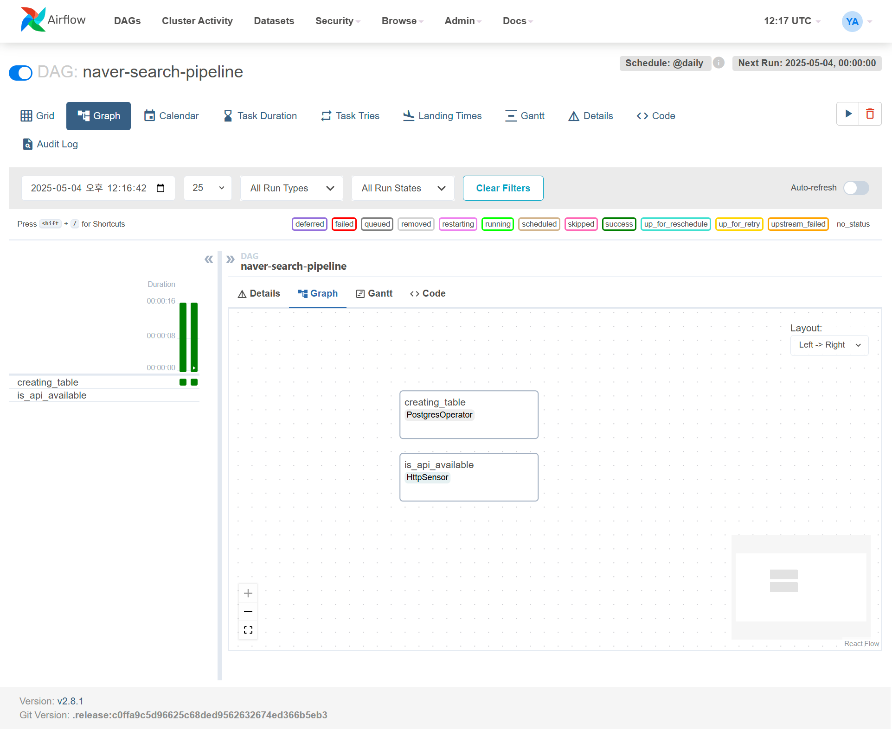

```bash
$ curl -LfO 'https://airflow.apache.org/docs/apache-airflow/2.8.1/docker-compose.yaml'
```

```bash
$ mkdir -p dags logs plugins
$ echo -e "AIRFLOW_UID=50000\nAIRFLOW_GID=0" > .env
```

```bash
$ docker compose up airflow-init
```

```bash
$ docker compose up
```

```bash
$ docker compose run --rm airflow-cli users create \
  --username admin \
  --password admin \
  --firstname YourName \
  --lastname Admin \
  --role Admin \
  --email admin@example.com
```

### 접속

- http://localhost:8080

- 기본 계정 로그인

  - Username: airflow

  - Password: airflow

### 생성된 테이블 확인

docker exec -it <postgres_container_name> psql -U airflow -d airflow

```bash
$ docker exec -it airflow-docker-postgres-1 psql -U airflow -d airflow
```

airflow-docker-postgres-1: Docker Desktop에서 확인한 PostgreSQL 컨테이너 이름

-U airflow: 사용자명

-d airflow: 데이터베이스명

```bash
$ docker exec -it airflow-docker-postgres-1 psql -U airflow -d airflow
psql (13.20 (Debian 13.20-1.pgdg120+1))
Type "help" for help.

airflow=# \dt
airflow=# SELECT  * FROM naver_search_result;
 title | address | category | description | link
-------+---------+----------+-------------+------
(0 rows)

airflow=#
```

### Add Connection


### API Test

https://developers.naver.com/docs/serviceapi/search/local/local.md#%EC%A7%80%EC%97%AD

```bash
$ curl "https://openapi.naver.com/v1/search/local.xml?query=%EC%A3%BC%EC%8B%9D&display=10&start=1&sort=random" \
    -H "X-Naver-Client-Id: {애플리케이션 등록 시 발급받은 클라이언트 아이디 값}" \
    -H "X-Naver-Client-Secret: {애플리케이션 등록 시 발급받은 클라이언트 시크릿 값}" -v
```



### 위에서 추가한 태스크 테스트

```bash
cd ~/AIRFLOW
airflow tasks test <DAG_ID> <TASK_ID> <DATE>
```

가상환경

```bash
$ airflow tasks test naver-search-pipeline is_api_available 2024-01-01
```

docker

```bash
$ docker exec -it airflow-docker-airflow-webserver-1 airflow tasks test naver-search-pipeline is_api_available 2024-01-01

```


### 결과 확인


### HttpSensor

기본적으로 다음처럼 작동

poke_interval=60

timeout=60 \* 60

response_check에 지정된 함수가 True를 반환하면 성공 처리

False를 반환하거나 예외가 발생하면 계속 반복

위와 같은 특성 때문에 아래 코드와 같이 작성하고 테스트하면 주기적으로 요청되므로 True/False 반환하도록 수정

```python
is_api_available = HttpSensor(
        task_id="is_api_available",
        http_conn_id="naver_search_api",
        endpoint="v1/search/local.json",

        headers={
            "X-Naver-Client-Id" : f"{NAVER_CLI_ID}",
            "X-Naver-Client-Secret" : f"{NAVER_CLI_SECRET}",
        },
        request_params={
            "query" : "toast",
            "display" : 3
        },
        response_check=lambda response: print(response.json())
    )
```

### Result


### Airflow?

일련의 일들을 순차적으로 진행시켜주는 프로젝트 관리자

### 중간 오류

Docker Desktop UI에서는 컨테이너 이름에서 docker-compose 프로젝트 이름을 생략한 형태로 보여주는 경우 혼동이 생길 수 있음

왜 이름이 다르게 보이냐면?
실제 컨테이너 이름은:

```css
[프로젝트 디렉토리 이름]-[서비스 이름]-[번호]
```

Docker Desktop은 이걸 축약해서 그냥 postgres-1 이렇게만 보여주고 있음 그래서 CLI에서 보면 airflow-docker-postgres-1이고, Docker Desktop에서는 postgres-1처럼 보임

docker ps => airflow-docker-postgres-1
Docker Desktop UI => postgres-1

이름 충돌을 방지하기 위해 실제 컨테이너 이름은 더 길고 명확하게 붙고, UI는 간단히 보여주는 거
